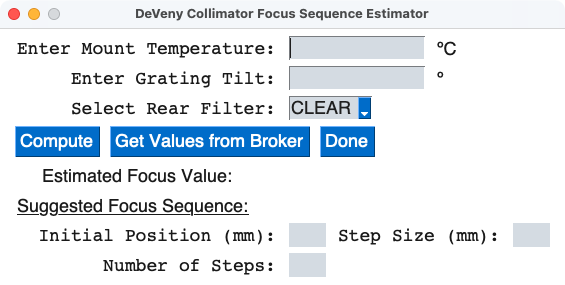

.. include:: include/links.rst

.. |nbsp| unicode:: 0xA0 
   :trim:

.. _deveny_collfocus:

=================================
DeVeny Collimator Focus Estimator
=================================

Status: Completed 2023-07-31

Overview
========

The internal optics of the DeVeny Spectrograph are focused by pistoning the
collimator mirror (a separate task from focusing the telescope onto the 
spectrograph).  The DeVeny LOUI includes a tab for performing a focus sequence
(images of arc lines interleaved with collimator focus moves).  The purpose
of this GUI tool is for estimating the values you should input into the LOUI.

For a discussion of the physics behind the collimator focus procedure
(including the origin of the equation below), see the DeVeny User Manual.  An
empirical analysis of collimator focus values from data taken in 2017-2020
yield the approximate relationship:

.. math::

    \begin{aligned}
    \mathrm{collimator~focus}~\approx&~11.0 - 0.08~T_{\rm m} \mathrm{(^{\circ} C)} - 0.14~(\mathrm{tilt} - 25^{\circ}) + 0.7~\delta_{\rm filter}~~~\mathrm{mm} \\
    \delta_{\rm filter} &=  \begin{cases} \mbox{0,} & \mbox{if no order-blocking filter (REARFILT = Clear (C))}  \\ \mbox{1,} & \mbox{if using an order-blocking filter (e.g., GG420)} \end{cases}
    \end{aligned}

where :math:`T_{\rm m}` is the mount temperature and tilt is the grating tilt
angle.  The RMS of the fit is :math:`\sim 0.6` |nbsp| mm.  This equation is coded into
the GUI tool.

Unlike other focus procedures at LDT, the DeVeny LOUI focus sequence script
does not take the *expected* focus value, but rather one end of the range,
along with the step size and number of steps.  This tool is designed to assist
you in constructing a range that centers on the value computed from the
equation above to most efficiently complete the focus procedure.

After the images have been taken, use the :doc:`dfocus` program to analyze the
images and compute the appropriate focus position.

Usage
=====

The script usage can be displayed by calling the script with the
``-h`` option:

.. include:: help/deveny_collfocus.rst

When the application launches, a GUI window will appear as in
:numref:`collfocus_startup`.

.. _collfocus_startup:

    -- The ``deveny_collfocus`` GUI at startup.

If the application is launched from one of the observer computers at LDT
(``dct-obs1`` or ``dct-obs2``), it will have the option to pull the current
values for the mount temperature and grating tilt angle from the broker.  The
current grating angle should always available on the broker, but the TO needs
to have the their control software running before the mount temperature will be
available (and it may still take up to a minute or so for the appropriate
broker topic to update).  Load the current values from the broker by pressing
the "Get Values from Broker" button.

Whether you load the value from the broker or use this tool at home, you may
still manually enter the mount temperature and grating tilt angle in the GUI
windows.  You will always need to select the rear filter setting you are using.

When you click "Compute", the bottom half of the GUI is populated with the
estimated focus value from the equation above and values to enter into the
DeVeny LOUI focus sequence tab.  See :numref:`collfocus_values`.

.. _collfocus_values:
.. figure:: figures/deveny_collfocus_values.png
    :class: with-shadow
    :alt: GUI after clicking "Compute"

    -- The ``deveny_collfocus`` GUI after clicking "Compute".  The estimated
    focus value (with uncertainty) is printed, along with suggested values for
    use with the LOUI Focus Sequence tab.

Observers should note that the lower limit on the collimator focus motorized
stage is 7.75 mm.  In warm weather and/or for large grating tilt angles, the
optimal focus may lie beyond this limit.  Set the collimator focus value at
the lower limit and press on.
