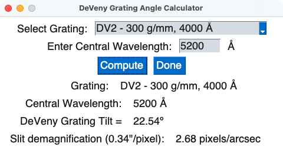

.. include:: include/links.rst

.. |nbsp| unicode:: 0xA0 
   :trim:

.. _deveny_grangle:

===============================
DeVeny Grating Angle Calculator
===============================

Status: Completed 2021-01-26

Overview
========

.. _grateq:

The Grating Equation
^^^^^^^^^^^^^^^^^^^^

The angles at which the diffracted light reflects off the grating are given
by the grating equation:

.. math::

    \begin{equation}
    m\lambda = d(\sin \theta _{i}-\sin \theta _{m})~,
    \end{equation}

where :math:`d` is the spacing between adjacent grooves on the grating,
:math:`\theta_{i} = \theta_{\rm grangle} + 10^{\circ}` is the incident angle,
and :math:`\theta_{m} = 55^{\circ} - \theta_{i}` is the outgoing angle for light
with wavelength :math:`\lambda` diffracting into order :math:`m` (see the
DeVeny user manual for a description of the physical layout of the
spectrograph).  The DeVeny gratings are typically operated in
1\ :superscript:`st`\  order (:math:`m = 1`), although use of :math:`m=2` would
possible with the proper short-pass order-blocking filters to remove
1\ :superscript:`st`\ -order light.

This tool computes the necessary tilt :math:`\theta_{\rm grangle}` by
numerically solving the equation below for a given grating.  The computation
uses the groove density (in g/mm) in place of :math:`d`, and finds
:math:`\theta_{\rm grangle}` for a specified 1\ :superscript:`st`\ -order
central wavelength (:math:`\lambda_c`) in Angstroms on the spectral CCD.

.. math::

    \begin{equation}
    \lambda_c~({\rm \mathring{A}}) = \frac{\sin(\theta_{\rm grangle} +10^{\circ}) - \sin(45^{\circ} - \theta_{\rm grangle})}{ {\rm groove~density~(g/mm)} }\times 10^7
    \end{equation}

Usage
=====

The script usage can be displayed by calling the script with the
``-h`` option:

.. include:: help/deveny_grangle.rst

In its default mode, the tool launches a GUI window as in
:numref:`grangle_startup`.

.. _grangle_startup:
.. figure:: figures/deveny_grangle_startup.png
    :class: with-shadow
    :alt: GUI at startup

    -- The ``deveny_collfocus`` GUI at startup.

Select your grating from the dropdown menu (this selects the groove density),
and enter your desired central wavelength (in angstroms).  When you click
"Compute", the bottom half of the GUI is populated with the needed grating tilt
value from the equation above and the computed slit demagnification value (see
the DeVeny user manual for a brief discussion of grating physics).  See
:numref:`grangle_values`.

.. _grangle_values:

    -- The ``deveny_grangle`` GUI after clicking "Compute".  The needed grating
    tilt angle and computed slit demagnification values have been populated.

There are two optional modes for running this tool:

    * ``--cli``: A command-line version of this tool, which looks and functions
      identical to the old IDL routine with the same name.

    * ``--max``: The GUI will have the option to compute the central wavelength
      from :math:`\theta_{\rm grangle}` in addition to the forward calculation
      done in the default mode.
