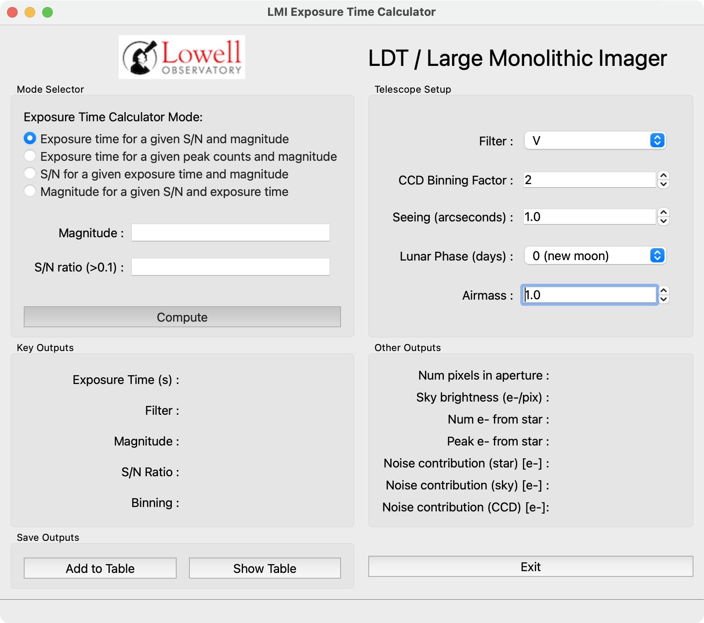
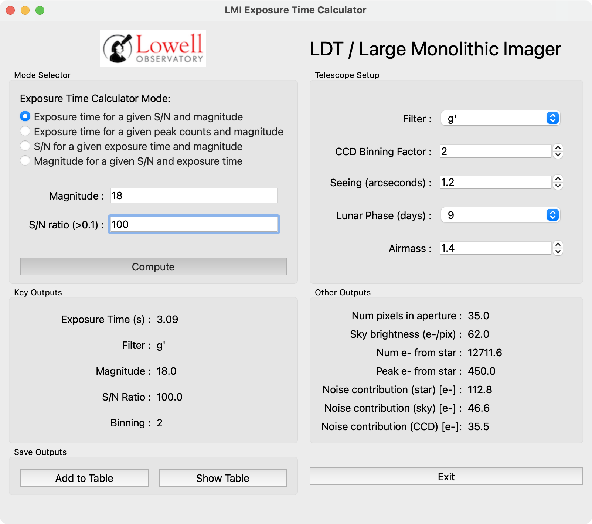
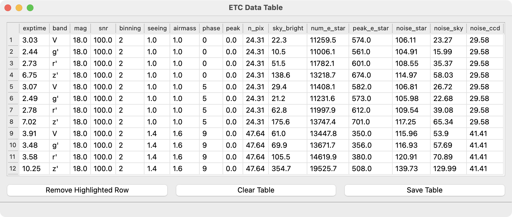

.. include:: include/links.rst

.. |nbsp| unicode:: 0xA0 
   :trim:

.. _lmi_etc:

============================
LMI Exposure Time Calculator
============================

Status: Completed 2025-07-22

Overview
========

The Basics of the Exposure Time Calculator
------------------------------------------

**This description was written by Phil Massey.  The original code was written
and tested by Kathryn Neugent.**

The LDT/LMI Exposure Time Calculator (ETC) is based upon the Appendix in the
Direct Imaging Manual for Kitt Peak (Massey et al. 1992, 2002) [1]_.  The
signal-to-noise ratio (SNR) is calculated as follows.  First, the signal
is simply the count rate (:math:`e^-`/sec) from the star :math:`N_*` measured
through some aperture times the exposure time :math:`t`.  The noise is
make up of three components, which are added in quadrature:

-  The photon noise from the star itself, :math:`\sqrt{N_*\times t}`.

-  The photon noise from the sky, :math:`\sqrt{S\times p \times t}`,
   where S is the count rate per pixel (:math:`e^-`/sec/pixel) and :math:`p` is
   the number of pixels in the measuring aperture.

-  The read-noise from the device :math:`\sqrt{p}\times R` in the
   measuring aperture, where :math:`R` is the read-noise per pixel.

Put this all together and we have:

.. math::
      :label: snr_eqn

      {\rm SNR}=\frac{N_* \times t}{\sqrt{N_* \times t + S\times p \times t + p \times R^2}}

In doing this, we have ignored dark current (which is usually
negligible), and flat-fielding errors.

Where do the individual parameters come from?
---------------------------------------------

We assume that the number of pixels :math:`p` is dependent on the
seeing, and that the astronomer will always measure the brightness of a
star using a near-optimal measuring aperture, `i.e.`, one that has a
radius that is about :math:`0.67\times` the full-width at half-maximum
(fwhm) [2]_. In that case the number of pixels :math:`p` will be
:math:`\pi \times (0.67 \times {\rm fwhm})^2 = 1.4 \times {\rm fwhm}^2`.
If the number of pixels is less than 9, we impose a minimal value of 9,
corresponding to a radius of 2.5 pixels.

With each of the telescope/CCD combinations, we have measured the
observed count rates (:math:`e^-`/sec) and then normalized the values to a
:math:`U=B=V=R=I=20` mag star observed, correcting for extinction to
outside the earth's atmosphere (airmass :math:`X=0.0`). Let's call these
values :math:`N_{\rm 20}`. Thus if we want to know :math:`N_*` for a
star of magnitude m that we plan to observe at an airmass of :math:`X` we
compute:

.. math:: m_{\rm corrected} =m + {\rm  extinction} \times  X

.. math:: N_*=N_{\rm 20} \times 10^{ -(m_{\rm corrected}-20.)/2.5}

The sky value :math:`S` (in :math:`e^-`/sec/pixel) is a little tricker to compute.
First, it clearly is a function of lunar phase, particularly at the
bluer wavelengths. Massey et al. (1992, 2002) have tabulated the sky
brightness (in mag/arcsec\ :math:`^2`) at various lunar phases, and
Frank Valdes performed a simple low order fit to these for use in
``ccdtime``, and we adopt these values here. Yes, the actual sky brightness
depends (a lot) on how far away from the moon you are pointing, but we
are trying to give reasonable ballpark estimates here. So, we know the
sky brightness :math:`s` in mag/arcsec\ :math:`^2`. The counts you
expect from the sky per arcsec\ :math:`^2` is thus
:math:`N_{\rm 20} \times 10^{-(s-20)/2.5}`. The area of a pixel is the
scale\ :math:`^2 \times` binining\ :math:`^2` (where the scale is in
arcsec/pixel) and so

.. math:: S=N_{\rm 20} \times 10^{-(s-20)/2.5} \times {\rm scale}^2 \times {\rm binning}^2.

The read-noise :math:`R` is a value you measure in the lab (and at the
telescope), and is typically :math:`\sim`\ 4-7 :math:`e^-`.

How do we do it?
----------------

Given any two parameters, we want the third. Here are the equations we
use, given the above.

Case 1: Given a magnitude and a SNR, what exposure time do we want?
+++++++++++++++++++++++++++++++++++++++++++++++++++++++++++++++++++

This is dealt with explicitly in Massey et al. (1992, 2002). If we solve
Equation :eq:`snr_eqn` for :math:`t`, we find ourselves with our old friend the quadratic
equation:

.. math:: t=\frac{-B + \sqrt{B^2 - 4\times A\times C}} {2\times A}

\ where

.. math:: A=N_*^2

.. math:: B=({\rm SNR})^2 \times (N_*+p\times S)

.. math:: C=({\rm SNR})^2 \times p\times R^2

Case 2: Given a magnitude and exposure time, what SNR to we achieve?
++++++++++++++++++++++++++++++++++++++++++++++++++++++++++++++++++++

This is the easiest case: we just plug our values into Equation :eq:`snr_eqn`.

Case 3: Given a SNR and exposure time, what magnitude do we reach?
++++++++++++++++++++++++++++++++++++++++++++++++++++++++++++++++++

This requires first solving Equation :eq:`snr_eqn` for :math:`N_*`, which again
requires the quadratic equation:

.. math:: N_*=\frac{-B + \sqrt{B^2 - 4\times A\times C}} {2\times A}

\ where

.. math:: A=t^2

.. math:: B=-t\times{\rm SNR}^2

.. math:: C=-{\rm SNR}^2\times S\times p \times t+ p \times R^2

Once we have :math:`N_*` we must turn it into a magnitude:

.. math:: m_{\rm raw}=-2.5\times \log{N_*/N_{\rm 20}}+20

That's the brightness of a star outside the earth's atmosphere. But we
aren't going to go as faint as that, as we are observing at some finite
airmass :math:`X`. So,

.. math:: m_{\rm corrected} = m_{\rm raw} - {\rm extinction}\times X

Output
------

We give the bandpass, magnitude, S/N, and exposure time, irrespective of
which two were input and which one is output. We also include the number
of pixels in the measuring aperture, the sky brightness (in :math:`e^-`/pixel),
the number of e from the star, the peak number of :math:`e^-` from the star (see
below), and the noise contributions from the three components.

The peak number of counts from the star :math:`P` will be (roughly):

.. math:: P=N_* \times t / (1.13 \times {\rm fwhm}^2),

\ where the fwhm is in pixels.

+----------------+-----+------+------+------+------+------+-----------+
| Table 1. Count |     |      |      |      |      |      |           |
| Rates Assumed  |     |      |      |      |      |      |           |
| :math:`N_{20}` |     |      |      |      |      |      |           |
| :math:`e^-`    |     |      |      |      |      |      |           |
| /sec/image     |     |      |      |      |      |      |           |
+================+=====+======+======+======+======+======+===========+
| Tel/Inst       | U   | B    | V    | R    | I    | VR   | Readnoise |
+----------------+-----+------+------+------+------+------+-----------+
| LDT/LMI        | 100 | 730  | 680  | 670  | 450  | 990  | 7.0       |
+----------------+-----+------+------+------+------+------+-----------+
| Hall/NASA42    | 3.1 | 17.1 | 17.5 | 19.7 | 12.8 | 25.0 | 4.6       |
+----------------+-----+------+------+------+------+------+-----------+

.. [1]
   https://noirlab.edu/science/documents/scidoc0110

.. [2]
   We leave it as an exercise for the student to determine why
   :math:`r=0.67\times {\rm fwhm}` is essentially the optimal measuring
   radius.

The above text was written by Phil Massey.  The original code for the `LMI
exposure time calculator <http://www2.lowell.edu/users/massey/LMI/etc_calc.php>`_
was written and tested by Kathryn Neugent.

Usage
=====

The script usage can be displayed by calling the script with the
``-h`` option:

.. include:: help/lmi_etc.rst

When launched, the GUI presents a window as in :numref:`lmi_etc_startup`.

.. _lmi_etc_startup:

    -- The ``lmi_etc`` GUI at startup.

Observation options may be set in the box at the top right (filter, seeing,
etc.).  Basic default values are loaded at startup.  The filter set is the
one for which basic values (star counts per second at :math:`m_v=20`,
extinction, etc.) have been measured.

Select one of the four modes in the top-left box for the computation.  The
input boxes below the radio buttons will display the proper input fields for
the chosed mode.  Clicking "Compute" will call the proper calculation routine
based on the mode and will display all of the computed values in the two
"Output" boxes (see :numref:`lmi_etc_compute`).

.. _lmi_etc_compute:

    -- The ``lmi_etc`` GUI displaying computed values.

Because many observers use exposure time calculators to help plan an observing
run, this tool has the added feature of saving the calculated values for each
setup to disk.  After performing a calculation, the user may add the presently
displayed values to a table using the "Add to Table" button.  The table (see
:numref:`lmi_etc_table`) may be shown / hidden using the "Show Table" button.

.. _lmi_etc_table:

    -- The ``lmi_etc`` data table after adding several proposed observations.

Within the data table window, the user may remove lines (`e.g.`, accidentally
duplicated entries), clear the entire table and start over, or save the
displayed table to disk.

At present, the save options are:

    * AstroPy's `Enhanced Character-Separated Values
      <https://docs.astropy.org/en/latest/io/ascii/ecsv.html>`_ format (``.ecsv``)
    * standard comma-separated values format (``.csv``)
    * AstroPy's `fixed-width text table
      <https://docs.astropy.org/en/latest/io/ascii/fixed_width_gallery.html>`_  (``.txt``)
    * FITS binary table (``.fits``)
