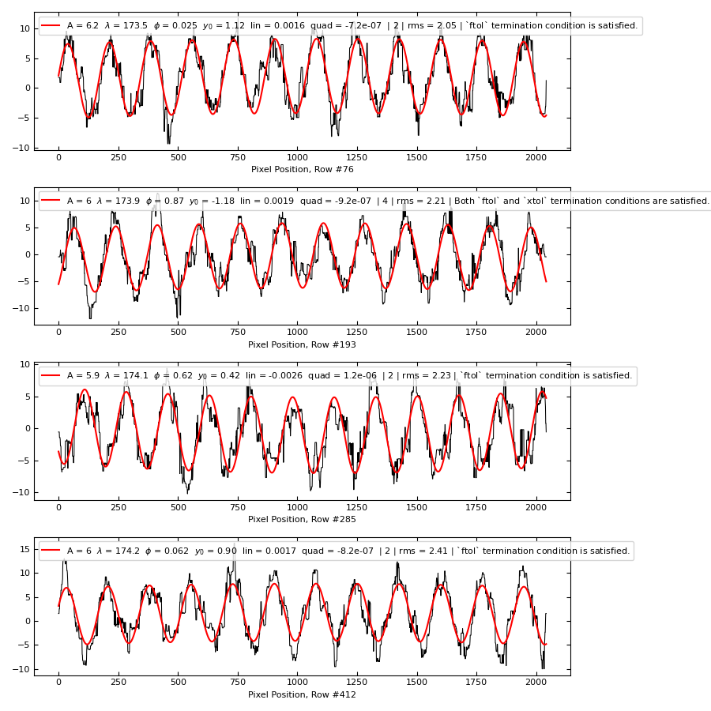

.. include:: include/links.rst

.. |nbsp| unicode:: 0xA0 
   :trim:

.. _scrub_deveny_pickup:

============================
DeVeny Pickup Noise Scrubber
============================

Status: *Beta Testing*

To report problems or suggest improvements, please submit a GitHub `Issue 
<https://github.com/LowellObservatory/LDTObserverTools/issues>`__ and/or
`Pull Request <https://github.com/LowellObservatory/LDTObserverTools/pulls>`__.
Please include the appropriate QA plot in your Issue/PR to illustrate the
problem you encountered.

Overview
========

The spectral channel CCD of the DeVeny Optical Spectrograph has been subject
to ground-loop EMI pickup in the readout electronics during most of its tenure
at the Lowell Discovery Telescope (LDT).  This pickup manifests in the science
images as a low-amplitude sinusoidal pattern sitting atop the raw 2D spectral
image.

In January 2018, the Instrument Group broke a significant ground loop,
eliminating a prominent "corduroy" noise pattern with amplitude :math:`\pm 4`
DN that had been affecting observers' low-SNR extractions.  At that point,
there still remained a low-level (:math:`\pm 2` DN) scalloping noise that shifted
from frame to frame, indicating another source of EMI.  After this brief
reprieve, however, changes on the LDT instrument cube led to the reappearance
of the larger :math:`\pm 4` DN "corduroy" pattern with that continues into 2023.
While the Instrument Group works diligently to identify and remove this
ground loop, the present tool is available for observers whose low-SNR
extractions are affected by this pickup signal.

.. _raw_frame:
.. figure:: figures/scrubber_raw_frame.*
   :class: with-shadow
   :alt: Raw DeVeny frame with sinusoidal pickup noise

   -- Raw frame from DeVeny taken in late 2022.  This is the frame for which
   we will show the scrubber processing steps in the sections below.  The
   object is the thin horizontal line in the center of the frame, and there are
   several prominent (vertical) night sky lines in addition to the wavy pattern
   caused by AC EMI pickup in the readout electronics of the CCD.

Fitting and removing the sinusoidal signal seen in :numref:`raw_frame` is
complicated by the presence of bright features in the raw frame such as the
observed object(s), night sky lines, and cosmic rays.  We use the spectroscopic
data reduction pipeline (`PypeIt
<https://pypeit.readthedocs.io/en/release/index.html>`_) with a particular set
of parameters to mask cosmic rays and extract night sky lines and object
spectra.  With these bright signals removed, we can then to fit sinusoids to
the residual noise image to produce a pattern image representing the EMI
signal.  This patten is then subtracted from the original image and saved to
a FITS file for usual data reduction processing (preferably with PypeIt) to
yield an extracted 1D spectrum for analysis.

Example Pre- and Post-Scrubbed Data Products
^^^^^^^^^^^^^^^^^^^^^^^^^^^^^^^^^^^^^^^^^^^^

To illustrate the need for and utility of this tool, :numref:`spec1d_comps`
shows a comparison of the extracted 1D spectra for two different object types
from two different programs (and nights) from both the original and scrubbed
version of the frame.  The galaxy is the (horizontal) object in the middle of
:numref:`raw_frame`.  Not only does this tool remove the sinusoidal oscillation
in the continuum, but astrophysical measurements are more accurately measured
from the spectra.

.. _spec1d_comps:
.. figure:: figures/spec1d_scrub_double_compare.*
   :class: with-shadow
   :alt: Comparison of raw and scrubbed extracted 1D spectra

   -- Comparison of the PypeIt-extracted 1D spectra for two different object
   types (from different programs).  For each object, the raw and scrubbed
   frames are shown to illustrate the utility of this tool. The red dashed
   line represents the :math:`1\sigma` uncertainty in the spectrum.  PypeIt
   estimates a mean :math:`SNR = 4.8` for the scrubbed galaxy spectrum and
   a mean :math:`SNR = 7.2` for the scrubbed white dwarf spectrum.

Of equivalent interest to the quality of the extracted spectra is the noise
remaining after extraction of sky and objects.  Shown in :numref:`prepost_noise`
are the noise analysis plots from PyepIt for the pre- and post-scrubbed
versions of the 2D spectral image shown in :numref:`raw_frame`.  The images and
pixel histograms are of the residual noise image, which is the science image
minus the object and sky models, and then divided by the uncertainty image.
The ideal pixel histogram would be a gaussian with width :math:`\sigma=1`.

.. _prepost_noise:
.. subfigure:: A|B
   :gap: 2px
   :class-grid: outline

   .. image:: figures/pypeit_spec2d_noise_prescrub.png
      :alt: Pre-scrubbed noise analysis plot

   .. image:: figures/pypeit_spec2d_noise_postscrub.png
      :alt: Post-scrubbed noise analysis plot

   -- Noise analysis of the pre- (top) and post-scrubbed (bottom) versions of
   the frame shown in :numref:`raw_frame`.  Image values are residual image
   divided by uncertainty, so the ideal pixel histogram would be a gaussian
   with width :math:`\sigma=1`.  Note the improvement in both the visual
   quality of the scrubbed frame and the width and shape of the pixel histogram
   compared to the pre-scrubbed frame.

Outline
^^^^^^^

This document begins with a description of how to use this tool to clean the
EMI pickup noise from your data, and moves on to lay out the details of what
the tool does to your data and other points to consider.

.. _scrub_process:

Data Processing Steps
=====================

1. Before the pickup noise may be fit out, it is necessary to perform a basic
   spectroscopic reduction using the PypeIt pipeline.  The outline of how to
   perform this reduction is given in the `DeVeny User Manual
   <https://confluence.lowell.edu/display/LDTOI/DeVeny+Optical+Spectrograph>`_.
   What is needed for this tool, however, is not a completely normal reduction
   procedure, and it is important to not modify any of the object finding, sky
   subtraction, or extraction parameters (except as enumerated below) in your
   PypeIt Reduction File for this step.  The scrubber tool expects certain
   qualities of the processed images in order to successfully fit the EMI
   noise.
   
   In particular, to perform a sky subtraction in a way to limit the number and
   severity of artifacts introduced into the residual noise image and to not
   spend time computing spectral flexure, the user should include the following
   in the Parameter Block of the ``.pypeit`` file:

    .. code-block:: ini

      [flexure]
         spec_method = skip
      [reduce]
         [[skysub]]
            bspline_spacing = 100
            local_maskwidth = 200.
            no_poly = True

   .. warning::

      If you are using a version of PypeIt ``< 1.15.0`` (see the top line of
      the PypeIt Reduction File for the version number), then you will instead
      need to add the entirety of the following to the Parameter Block to
      ensure the traced slit edges do not shrink unreasonably and that pattern
      noise in the CCD overscan does not introduce artifacts in the fitting.
      Regions outside the marked slits will have 0 value in the residual image,
      and therefore any sinusoidal signal there will not be fit out.  (The
      additional parameters included here were added to the DeVeny default set
      in PypeIt version ``1.15.0``.)

      .. code-block:: ini

         [flexure]
            spec_method = skip
         [reduce]
            [[skysub]]
               bspline_spacing = 100
               local_maskwidth = 200.
               no_poly = True
            [[findobj]]
               find_trim_edge = 0,0
         [calibrations]
            [[slitedges]]
               minimum_slit_length = 170
               max_nudge = 5
               det_buffer = 0
            [[flatfield]]
               tweak_slits = False
         [scienceframe]
            [[process]]
               overscan_method = polynomial
               overscan_par = 1,0,0

2. Once the PypeIt reduction is complete, you are ready to run the scrubber.
   In the directory containing the raw files, run the scrubber (see
   :ref:`usage`) on the files in the directory.  If an input file is **NOT**
   an object science frame (*e.g.*, it is a bias or dome flat), it will be
   skipped without being processed.  The scrubber will use both the raw frame
   and the processed 2D spectrum (in the ``ldt_deveny_?/Science`` directory)
   to fit the sinusoidal pickup noise and produce a cleaned image, saved to
   a FITS file in the raw directory.

3. After the scrubber has completed its work, you will need to perform a normal
   PypeIt data reduction workflow, starting with the ``pypeit_setup`` script to
   include the scrubbed files in a new PypeIt Reduction File.  At this point,
   you may remove the lines in the ``.pypeit`` file corresponding to the
   original images and add any parameter modifications you desire, including
   those affecting object finding and extraction.  In particular, **DO NOT**
   include the ``[flexure]`` and three ``[[skysub]]`` parameters used in Step
   #1 above, as they may cause unpleasant artifacts in the actual reduction of
   your data.

.. note::

   In a future version of this tool, it may be possible to combine steps #1 and
   #2, so that the user need not concern themselves with the particular PypeIt
   parameter modifications here, and would only need run this tool on the raw
   data (which will include an integral PypeIt reduction) before running the
   usual PypeIt reduction steps.

.. _usage:

Usage
=====

Command Line
^^^^^^^^^^^^

The tool usage can be displayed by calling the script with the
``-h`` option:

.. include:: help/scrub_deveny_pickup.rst

You may specify either a single ``file`` for the scrubber to process, or
include a list of files (by way of wildcards or shell filename expansions)
over which the tool should iterate.

The ``--proc_dir`` option may be used to specify the location of the
PypeIt-processed files (*i.e.*, the ``ldt_deveny_?`` directory you created
with ``pypeit_setup``), if other than as a subdirectory of the raw data
directory.  This works in the same sense but opposite direction as the ``-r
<RAWDIR>`` option to ``pypeit_setup``.  In particular, if you did not specify
``-r <RAWDIR>`` to ``pypeit_setup``, do not use this option.

To simply overwrite the raw data file with the output of this tool, the
``--overwrite_raw`` option may be specified.  Since the output FITS file
created here includes the entirety of the raw frame (all header cards plus the
raw image), this may be acceptable if processing large number of files.

Other options shown are debugging tools that may be removed in the future.

Terminal Output
^^^^^^^^^^^^^^^

When run, the tool prints to the screen information about the current
processing step and produces progress bars when repeatedly running an algorithm
on multiple rows of the image.  The terminal output for the example frame used
in this documentation is shown below.

.. code-block:: console

   $ scrub_deveny_pickup 20290101.0001.fits

   Processing frame 20290101.0001.fits
   --> FFT-predicted pixel period: 169.7 pix
   Checking the object model for bulk sinusoidal signal...
   100%|██████████████████████████████████████████| 46/46 [00:01<00:00, 23.84row/s]
   * Object model appears clean of target sinusoidal signal.
   Fitting sinusoids to each line in the image...
   100%|████████████████████████████████████████| 508/508 [00:10<00:00, 50.45row/s]
      --> Mean fit pixel period: 172.9 pix
   Refitting lines with poor fit in first pass...
   100%|██████████████████████████████████████████| 63/63 [00:01<00:00, 50.86row/s]
      --> Mean fit pixel period: 173.7 pix
   Refitting all lines within the slit assuming nearly constant sinusoid...
   100%|████████████████████████████████████████| 478/478 [00:07<00:00, 62.00row/s]
      --> Mean fit pixel period: 173.7 pix
    Writing QA plots to ./ldt_deveny_A/QA/PDFs
   Writing out scrubbed FITS file: 20290101.0001_scrub.fits

Important pieces to note in the terminal output:

* The FFT-predicted and mean sinusoid fit pixel periods are printed for quality
  assurance purposes.

* If the PypeIt-reduced ``spec2d`` file contains a non-zero object model, the
  code will analyze it for the sinusoidal signal at the predicted period.  If
  the object model contains this signal, then the residual noise image
  (``sciimg`` - ``skymodel`` - ``objmodel``) will be missing power from the
  pickup noise (*i.e.*, that power was extracted into the object model).  In
  this case, the tool will print a statement indicating that the object model
  will be included in the residual image and the amplitude of the sinusoidal
  fit (for QA purposes).  If the object(s) remains extracted (*i.e.* does not
  contain bulk sinusoidal signal), the tool will print the message: ``Object
  model appears clean of target sinusoidal signal``.

* The first pass at fitting sinusoids to the image should include all rows in
  the (trimmed) image (FITS keyword ``TRIMSEC``).  In this example, the CCD was
  binned ``1x1``, so there were 516 rows in the original image, trimmed down to
  508.

* As an iterative step, the tool assesses the rms residuals of the fit and
  determines if there are outliers that need to be refit using initial guess
  parameters from nearby well-fit rows.  The number of rows indicated in this
  progress bar is less than the total image, and can vary based on the
  particular pattern noise in the image.

* The EMI signal should be roughly constant in amplitude and period over the
  approximately 8 seconds the CCD takes to read out.  Therefore, as a final
  step, the tool fits the amplitude and period fit coefficients with a
  low-order polynomial as a function of row number to account for the
  secular drift in the sinusoid period that causes the mean period to change
  from frame to frame.  With the polynomial fit in hand, one last pass at
  fitting sinusoids to the rows is completed, fixing the period and amplitude
  while allowing the phase and underlying secular drift of the row to be fit.
  This pass only fits rows identified within the slit, so may have fewer rows
  to process than the full frame.

* Finally, the location of QA plots and filename of the scrubbed FITS file are
  shown for reference.

Output FITS File
^^^^^^^^^^^^^^^^

The output of this tool is a multiextension FITS with filename identical to the
raw file (including path) except with "_scrub" appended before ".fits".  It
includes the following HDUs:

  * Primary HDU: contains the raw file's complete FITS header
  * Cleaned Image HDU: (``raw`` - ``pattern``)
  * Original Image HDU: (``raw``)
  * Pattern Image HDU: (``pattern``)
  * Pattern about Raw Mean Image HDU: (``pattern`` + ``mean(raw)``)
  * Fit Coefficients BinTable HDU: (``fit_coeffs``)

Running the AstroPy utility ``fitsinfo`` yields the following:

.. code-block:: console

   $ fitsinfo 20290101.0001_scrub.fits
   Filename: 20290101.0001_scrub.fits
   No.    Name      Ver    Type      Cards   Dimensions   Format
     0  PRIMARY       1 PrimaryHDU     193   ()
     1  CLEANED       1 ImageHDU        10   (2148, 516)   float64
     2  ORIGINAL      1 ImageHDU        12   (2148, 516)   int16 (rescales to uint16)
     3  PATTERN0      1 ImageHDU        10   (2148, 516)   float64
     4  PATTERN1      1 ImageHDU        10   (2148, 516)   float64
     5  FIT DATA      1 BinTableHDU     50   508R x 15C   [D, D, D, D, D, D, D, D, D, D, D, D, D, D, D]

The ``ORIGINAL`` raw data frame is included in the scrubbed output for reference
and posterity.  The fitted sinusoidal pattern is included in two different
formats, one with a zero mean (``PATTERN0``) and the other with the raw image
mean (``PATTERN1``) for use as desired (*e.g.* it is easier to compare
``PATTERN1`` to the raw image in ``ds9``, but the actual signal removed from
the raw image is ``PATTERN0``).  Finally, the sinusoidal fit coefficients are
included for perusal.

When processing the scrubbed frames with PypeIt, the data reduction pipeline
will recognize the scrubbed image and use the ``CLEANED`` HDU for processing
without user intervention.

QA Plots
^^^^^^^^

The tool generates three quality assurance (QA) plots per frame to allow the
user to assess the scrubbing.  All QA plots are placed into the PypeIt ``QA/``
directory for convenience. Within the PypeIt ``QA/`` directory, that pipeline
places its QA plots into a ``PNGs/`` subdirectory (because the plots are PNG
format).  To keep QA files from this tool separate (yet also in an easy-to-find
location), files generated here are in the ``PDFs/`` subdirectory (because, wait
for it, they are in PDF format).

The three files are:

1. The FFT QA plots showing the frequencies found and indicating the likely
   period of the EMI noise.  (See :numref:`fft_analysis` as an example.)
   These have the filename template ``YYYYMMDD.NNNN_scrubber_fft_analysis.pdf``
   where the ``YYYYMMDD.NNNN`` corresponds to the filename of the raw frame.

2. The sinusoidal fits QA plots showing the row-by-row fit coefficients and
   rms residuals.  (See :numref:`sinusoid_fits` as an example.)  These have
   the filename template ``YYYYMMDD.NNNN_scrubber_sinusoid_fits.pdf``.

3. Image comparison QA plots showing the various stages of the analysis
   including the original (PypeIt-processed) frame, residual image, modeled
   pattern noise, and cleaned image.  (See :numref:`image_comparisons` as an
   example.)  These have the filename template
   ``YYYYMMDD.NNNN_scrubber_image_comparisons.pdf``.

.. _scrub_details:

Algorithmic Details of the Scrubbing
====================================

Here we describe the processing details for the scrubber and illustrate example
QA plots generated by the tool.  

The fitting of the sinusoidal pickup noise is done on the residual
PypeIt-processed image, in which cosmic rays, the sky model, and (frequently)
the object have been removed, leaving behind the underlying noise in the image.
This is done because bright features in the raw science frame such as night sky
lines and objects obfuscate and cover the few-DN amplitude AC signal we wish to
remove.  We take advantage of the sophisticated modeling algorithms in PypeIt
to do this heavy lifting for us, leaving us to concentrate on the
DeVeny-specific issues at hand.  See :numref:`image_comparisons` below for an
illustration of the various processing steps and frames used.

.. important::

   PypeIt converts all raw images from ADU into electrons using the gain value
   recorded in the FITS header.  For DeVeny, this is 1.52 e-/ADU.  The QA plots
   shown here are constructed from the PypeIt-processed images, and so are in
   electrons.  The :math:`\pm 6` electron amplitude illustrated here translates
   to a :math:`\pm 4` DN signal in the raw images.

.. note::

   Include a description of when the object may or may not be included in the
   residual image -- namely if the object model from PypeIt contains
   sinusoidal signal of the period indicated from the FFT.

FFT Analysis
^^^^^^^^^^^^

The EMI pickup noise present in the DeVeny images has an unpredictably variable
apparent frequency (or wavelength in pixel space) from frame to frame.  The
secular variation in the frequency is slow enough, however, that the measured
wavelength of the sinusoidal noise is approximately constant across a single
image given the :math:`\sim 8` second readout time of the spectral channel
CCD.

Estimation of the mean sinusoid period is done with a fast fourier transform
(FFT).  Rather than attempt to pull the (varying) horizontal frequencies out
of a 2D FFT, the image is instead flattened into a timeseries-like array, where
pixels are arranged in the order in which they were read out.  In its
processing, PypeIt trims the raw image to remove overscan sections and unruly
rows at the edges of the CCD.  As such, the last pixel of one row is not
strictly temporally adjacent to the first pixel of the next row in the same way
that pixels within a given row are.  Rather than attempt to fill in a
temporally appropriate gap between rows (which would introduce artifacts in the
resulting FFT), we simply stitch the rows together as-is and rely upon the FFT
to pick out the prominent frequencies in the flattened array.

An example QA plot for the FFT analysis is shown in :numref:`fft_analysis`.

.. _fft_analysis:
.. figure:: figures/scrubber_fft_analysis.*
   :class: with-shadow
   :alt: FFT analysis of the flattened frame

   -- FFT QA plot.  The top panel shows the flattened image array, while the 
   remaining rows show the real (amplitude as a function of frequency),
   imaginary (phase as a function of frequency), and absolute square (power
   spectrum) components of the FFT.  The power spectrum is further smoothed
   with a gaussian kernel to help isolate desired signal (with variable
   frequency, as discussed above) from artifacts and ringing in the FFT.
   The peak at 169.7 pixels indicates the frequency with the most power in the
   flattened array: most likely the period of the AC EMI pickup noise.

The power spectrum of the FFT (absolute value squared) is smoothed with a 10-Hz
wide gaussian kernel since there is variation in the frequency of the sinusoid
from row to row.  This has the added benefit of squashing artificial peaks in
the power spectrum caused by ringing or aliasing of the signal across rows.
We use the pixel period of the peak of the power spectrum as the initial guess
for the iterative fitting of a sinusoid (in pixel space) to each row of the
residual image.

Row-by-Row Sinusoid Fits
^^^^^^^^^^^^^^^^^^^^^^^^
With an initial guess at the sinusoid period in hand, the tool moves on to fit
a sinusoid to each row in the image.  This is an iterative process, where the
results of one pass inform the initial guess and bounds on the fit parameters
for subsequent passes.  In addition to a basic sinusoid (amplitude, period, and
phase), a quadratic polynomial is included to account for secular drift in the
background.  The :func:`~scipy.optimize.curve_fit` function from
:mod:`scipy.optimize` is used to perform a non-linear least-squares fit to each
row, with bounds placed on the sinusoid terms to keep the final fit reasonably
close to initial guess values.

:numref:`sinusoid_fits` shows the result of this iterative fitting for this
example frame.  During each pass, the rms of the fit is computed for each row
as an estimate of how well any particular row's model matches the data.  The
mean and standard deviation of the row-by-row rms values (bottom panel in
:numref:`sinusoid_fits`) are used to identify outliers that likely have a poor
fit after the first pass.

In the second pass, these outlier lines are refit with tighter bounds and using
the fit values from nearby "good" rows as the initial guesses.  The collection
of fit values as a function of row number after the second pass are shown in
orange in :numref:`sinusoid_fits`.  As a result of this iterative process, the
set of sinusoidal fits tends to have a narrow range of values for amplitude
and period.

For the final pass, the tool assumes that the underlying EMI noise is nearly
constant in period and amplitude.  A low-order (quadratic) polynomial is fit to
the top two plots in :numref:`sinusoid_fits` to estimate the true sinusoidal
signal imprinted on the frame.  The sinusoidal fits for this pass fix the
values of the period and amplitude to those smooth values (black lines in
:numref:`sinusoid_fits`), allowing the phase and secular drift of the row to be
fit.  As a result, the sinusoid phase from row to row is a smoother function,
and the rms of the fit is generally a little smaller than the orange fit.

The pattern image produced from these final fit coefficients (see
:numref:`image_comparisons`) closely resembles the unwanted pattern in the raw
frame.  Note, however, that the final pixel periods tend to be slightly larger
than that predicted from the FFT (green dashed line in the second panel of
:numref:`sinusoid_fits`).  The origin of this discrepancy is not clear (see
:ref:`fourier_analysis` for further discussion).

.. _sinusoid_fits:
.. figure:: figures/scrubber_sinusoid_fits.*
   :class: with-shadow
   :alt: Sinusoid fits to each row

   -- Sinusoid fit QA plots, showing the row-by-row fit
   parameters for the amplitude, period, and phase in the first three panels,
   and the rms of the fit in the bottom panel.  In the period panel, the
   green dashed line indicates the peak of the FFT power spectrum used as the
   initial guess for the sinusoid fit parameters.

Pickup Noise Pattern Construction
^^^^^^^^^^^^^^^^^^^^^^^^^^^^^^^^^

The final result of sinusoid fits is a constructed pattern image.  This is the
zero-mean sinusoid (sans quadratic polynomial) that *should* represent only the
EMI pickup noise (as an additive AC-only signal).  :numref:`image_comparisons`
shows the process of pattern construction and its effect on the processed
science image.

.. _image_comparisons:
.. figure:: figures/scrubber_image_comparisons.*
   :class: with-shadow
   :alt: Image comparison plot showing initial, intermediate, and final images

   -- This QA plot illustrates the image-space effects of the sinusoidal fits.
   Panels are all shown with the `IRAF ZScale mapping
   <https://docs.astropy.org/en/stable/api/astropy.visualization.ZScaleInterval.html>`_;
   panels sharing a color map also share visualization scale limits. The panels
   are described below.

Panel Description:

1. The science image after the initial PypeIt processing.  Without scrubbing,
   this would be the 2D image from which the object(s) are extracted.

2. The PypeIt sky + object model, where the local sky modeling has included the
   entire slit thanks to the ``local_maskwidth = 200.`` specified in the PypeIt
   Reduction File.  If the object is not included here, it is because the 
   extracted object model includes power from the sinusoidal EMI signal and
   must therefore be included in the residual image for fitting.  The sky is
   purposefully broad-brush and blurred so as to not induce artifacts in the
   fitted pattern by including, *e.g.*, contiguous rows of sinusoids with
   similar phase in the sky model (rather in the noise pattern where it
   belongs).

3. The PypeIt residual image, where the sky model (and frequently the object
   model) has been subtracted and cosmic rays (and other bad pixels) have been
   masked.  What *should* remain in this image is flat residual noise with rms
   based on the sky model photon statistics.  In the case of DeVeny images
   subject to the EMI pickup noise, that noise should be the dominant feature
   in this frame, with some residual sky lines because of the broad-brush sky
   subtraction above.

4. The modeled sinusoidal pickup noise.  While the sinusoidal fit to each row
   of the residual image (#3) includes a quadratic polynomial to account for
   secular variation in the background, only the base sinusoid is included in
   this pattern image to match the AC nature of the pickup.

5. The scrubbed residual image, where the pattern image (#4) has been
   subtracted off.  This frame should be largely featureless (except if the
   object is still included).

6. This is the scrubbed science frame (#1 minus #4), and it should be clear of
   the sinusoidal noise.  Even in frames where the phase difference of the
   pickup noise from row to row is such that large-scale wavy patterns are not
   visible in the base science image (#1), this scrubbed frame should be less
   noisy since a :math:`\sim 4` DN sinusoid has been removed from each line.

Panels #1, #2, and #6 are shown in a purple-red-yellow color map with common
scale limits based on the processed science image (range -15 e- to +51 e-), and
panels #3 - #5 are shown in a blue-green-yellow color map with common scale
limits based on the pattern image (range -6.1 e- to +6.1 e-) to illustrate
the completeness of the EMI signal removal.

--------

.. _appendix:

Appendix
========

For the adventurous reader, here is some additional information about the
development of the scrubber and various points of interest.

.. _fourier_analysis:

Line-by-Line Fits vs Fourier-Space Filtering
^^^^^^^^^^^^^^^^^^^^^^^^^^^^^^^^^^^^^^^^^^^^

.. todo::

   This section needs updated images and text.

Given the nearly constant frequency (manifested as a periodic sinusoid in
pixel space) of the AC EMI, one is tempted to attempt filtering the signal in
Fourier space rather than doing a line-by-line fitting.

The FFT computation is done on a flattened 1D version of the image, with the
pixels in time-order of readout.  Now, if the exact time between rows were
included as spacers between the rows of data in the 1D array, a single period
may emerge.  Since this is difficult to guess (and can vary within the readout
electronics), the rows were simply strung together one after another.  The
effect of this is a significant amount of ringing in the FFT caused by
breaks in the sinusoidal pattern from row to row.

We can run the computed EMI pattern image (4th panel in
:numref:`image_comparisons`) through the same FFT analysis routine to yield the
QA plot shown in :numref:`pattern_fft`.

.. _pattern_fft:
.. figure:: figures/pattern_scrubber_fft_analysis.*
   :class: with-shadow
   :alt: FFT analysis of the constructed pattern

   -- FFT QA plot, showing the flattened image array, the real
   (amplitude as a function of frequency) and imaginary (phase as a function
   of frequency) components of the FFT, along with the power spectrum
   (absolute value squared).  The power spectrum is further smoothed with a
   gaussian kernel to help isolate real signal (with variable frequency, as
   discussed above) from artifacts and ringing in the FFT.  The peak at 169.1
   pixels, indicating the frequency with the most power in the flattened array:
   most likely the period of the AC EMI pickup noise.

When compared to :numref:`fft_analysis`, most of the structure apparent in the
analysis of the residual image still appears here.  This is why simply applying
a notch filter in Fourier space around the peak of the FFT does not clean the
EMI noise, but rather amplifies the problem.  It is comforting that the peak
period found in the pattern image is identical to that in the residual image
(169.1 pixels), although both are smaller than the average pixel period found
in the sinusoid fitting (173.6 pixels).

Finally, we can perform the same analysis on the scrubbed residual image (5th
panel in :numref:`image_comparisons`).  The result is shown in
:numref:`cleaned_fft`.

.. _cleaned_fft:
.. figure:: figures/cleaned_scrubber_fft_analysis.*
   :class: with-shadow
   :alt: FFT analysis of the cleaned residual image

   -- FFT QA plot, showing the flattened image array, the real
   (amplitude as a function of frequency) and imaginary (phase as a function
   of frequency) components of the FFT, along with the power spectrum
   (absolute value squared).  The power spectrum is further smoothed with a
   gaussian kernel to help isolate real signal (with variable frequency, as
   discussed above) from artifacts and ringing in the FFT.  The peak at 169.1
   pixels, indicating the frequency with the most power in the flattened array:
   most likely the period of the AC EMI pickup noise.

Also, say something about the actual line-by-line fits in terms of how good a
sinusoid fits each one.  Show a figure like :numref:`line_by_line`.

.. _line_by_line:

   -- Examples of individual line fits for 4 randomly selected lines from the
   image shown in :numref:`raw_frame`.
